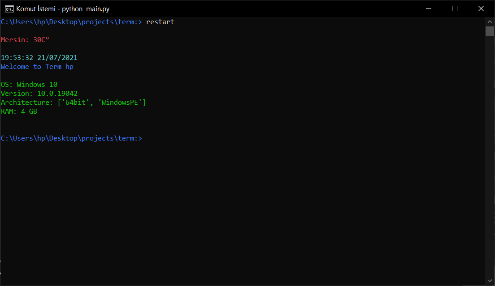

# Welcome to **Term** sir!

## ScreenShot

 

### Help Menu
---
    Here is the Term Help!
        cd          Change Directory (default)
        ls          List Directory (default)
        restart     Restart Script (adjust main.py directory to shell.py)
        exit        Exit (default)
        shutdown    Turns off the PC.
        config      Configurate Term.

        Colors: BLUE, GREEN, CYAN, RED, YELLOW
        
_python -v: 3.11.5_
 
_version: **0.1.2-beta-2**_